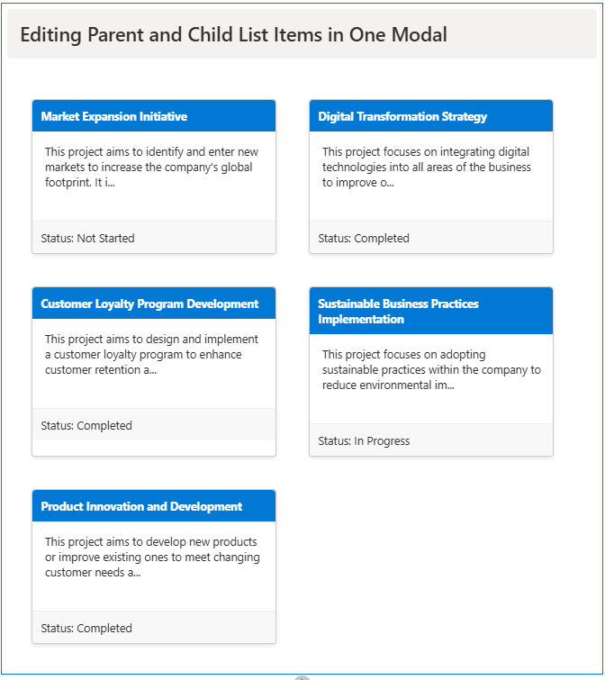
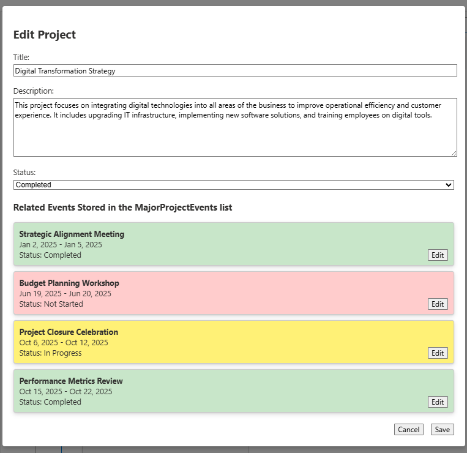
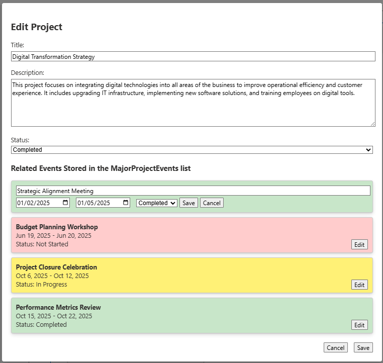

# Parent-Child List CRUD SharePoint Web Part

## Summary
A SharePoint Framework (SPFx) web part that demonstrates parent-child relationship between SharePoint lists, allowing CRUD operations on Major Projects and their related Events.

## Screenshots

### Project Cards View

### Edit Modal - Initial View

### Edit Modal - Event Editing

## Used SharePoint Framework Version
${require('./package.json').dependencies['@microsoft/sp-core-library']}

## Features
- Display Major Projects in a card layout
- Edit Project details (Title, Description, Status)
- Manage related Events within the same modal
- Real-time updates without page refresh
- Responsive design

## Prerequisites
- Node.js
- SharePoint Online tenant
- Required SharePoint lists:
  
  ### MajorProjects (Parent list)
  | Field Name | Field Type | Required | Notes |
  |------------|------------|----------|-------|
  | Title | Single line of text | Yes | Default field |
  | Description | Multiple lines of text | No | Plain text |
  | Status | Choice | Yes | Values: Not Started, In Progress, Completed |

  ### MajorProjectEvents (Child list)
  | Field Name | Field Type | Required | Notes |
  |------------|------------|----------|-------|
  | Title | Single line of text | Yes | Default field |
  | Start | Date and Time | Yes | Date and time format |
  | End | Date and Time | Yes | Date and time format |
  | Status | Choice | Yes | Values: Not Started, In Progress, Completed |
  | MajorProject | Lookup | Yes | Lookup to MajorProjects list (Title field) |

## Solution

Solution Name | Author(s)
------------ | -------------
parent-child-list-crud | [YOUR_NAME]

## Version History

Version | Date | Comments
------- | ---- | --------
1.0.0.0 | [DATE] | Initial release

## Setup Instructions
1. Clone this repository
2. Run `npm install`
3. Modify `config/serve.json` and update the `initialPage` URL to point to your SharePoint site's workbench page (e.g., "https://yourtenant.sharepoint.com/sites/yoursite/_layouts/workbench.aspx")
4. Run `gulp serve` to test locally
5. Run `gulp bundle --ship` and `gulp package-solution --ship` to create the deployment package

## Disclaimer
**THIS CODE IS PROVIDED *AS IS* WITHOUT WARRANTY OF ANY KIND, EITHER EXPRESS OR IMPLIED, INCLUDING ANY IMPLIED WARRANTIES OF FITNESS FOR A PARTICULAR PURPOSE, MERCHANTABILITY, OR NON-INFRINGEMENT.**

